# Evaluation — Full Results & Analysis

The complete evaluation record of the hybrid recommender: the experimental protocol, every
metric definition, the full results for all **12 models**, per-model analysis, robustness
checks, the hybrid-fusion analysis, the practical case study, and the honest limitations.

**Sources.** All numbers come from [`artifacts/metrics/all_metrics.json`](../artifacts/metrics/)
(written incrementally by notebooks 03–13); the deep-dive computations are notebook
[`14_advanced_eval.ipynb`](../notebooks/14_advanced_eval.ipynb); the practical study is
[`15_case_study.ipynb`](../notebooks/15_case_study.ipynb); the interactive version of this
document is [`16_evaluation_report.ipynb`](../notebooks/16_evaluation_report.ipynb). Model
internals (the maths behind each model) are in [`models.md`](models.md); the per-notebook
pipeline is in [`notebooks.md`](notebooks.md).

---

## 0. Executive summary

| Question | Answer |
|---|---|
| Best RMSE | **Dual-Head Hybrid — 0.8028** |
| Best MAE | **Stacked Hybrid — 0.6029** (Dual-Head 0.6031, a hair behind) |
| Best F1@10 | **LightGCN — 0.621** (ranking-only; coverage caveat) |
| Best F1@10 among rating-capable models | **Item-kNN — 0.433**, then **Dual-Head — 0.424** |
| Best combined profile (rating + ranking) | **Dual-Head Hybrid** (top RMSE, 2nd-best honest F1@10) |
| Do the hybrids beat every CB-only and CF-only baseline on RMSE/MAE? | **Yes — both learned hybrids do.** |

Five headline findings:

1. **The assignment's thesis holds.** Both learned hybrids (Stacked, Dual-Head) beat every
   content-only and collaborative-only baseline on **RMSE and MAE**, and sit in the honest top
   tier on **Precision/Recall/F1@K**.
2. **Rating-optimal ≠ ranking-optimal.** The best rating model is not the best ranker and vice
   versa (§6). The only model trained on a *ranking loss* (LightGCN) wins F1@K outright; the
   rating-trained SVD ranks mid-table despite near-best RMSE.
3. **Representation beats algorithm for content.** The identical content algorithm jumps from
   RMSE 1.046 → 0.967 (−7.6%) and F1@10 0.207 → 0.376 (+82%) just by swapping TF-IDF text
   features for the tag genome (§4.2).
4. **Learned fusion is what makes a hybrid worth it.** The fixed-blend Weighted Hybrid only ties
   SVD (Δ RMSE −0.0013); the learned meta-models open a real gap (−0.0054 / −0.0080) because they
   *learn* which signals to trust (§7).
5. **The aggregate story survives per-user scrutiny.** On four contrasting user archetypes
   (mainstream / niche / eclectic / light), the hybrid **wins NDCG@10 and AUC in all four**,
   has the best RMSE in three of four, and is never the worst on any metric (§9).

---

## 1. Experimental setup

### 1.1 Data

**MovieLens 25M**: 25,000,095 ratings · 162,541 users · 62,423 movies · half-star scale
0.5–5.0 · ~1.09M free-text tag applications · 1,128-tag genome with relevance scores. The
user–item matrix is **> 99.8% sparse**. The modal rating is **4.0** (positivity bias), which
grounds the relevance threshold (§1.4).

### 1.2 Split & leakage protections

- **User-wise temporal 80/10/10** ([`pipeline/splits.py`](../hybrid_recsys/pipeline/splits.py)):
  each user's ratings are sorted by timestamp and sliced — the first 80% → train, next 10% →
  validation, final 10% → test. Because rating volume grows over time, a random split would let
  models train on the future; the temporal split forbids it.
- Users with **< 5 total ratings are dropped** (`min_train_ratings=3` ⇒ at least 3 train +
  1 val + 1 test row); a guard moves one row from train when needed so every retained user has
  ≥ 1 test row.
- **Stacked Hybrid OOF**: its meta-learner is trained on **5-fold out-of-fold** base
  predictions, so no base model ever predicts rows it trained on (no optimistic leakage into
  the meta-weights).
- **Test discipline**: all hyper-parameters were chosen on validation or train-CV only; the
  test set was scored **exactly once** per model.

### 1.3 Tuning protocol (what was tuned, on what)

| Model | Tuned what | On |
|---|---|---|
| SVD | `n_factors ∈ {50,100,200}`, `n_epochs ∈ {20,40}`, `lr ∈ {0.002,0.005}`, `reg ∈ {0.02,0.05}` | 5-fold CV on train (RMSE) |
| User/Item-kNN | fixed `k=80, min_k=5`, Pearson-baseline | (standard values; no search) |
| Content (×3) | fixed top-L = 50 neighbours | (standard value; no search) |
| Weighted Hybrid | α ∈ [0, 1] step 0.05 | validation RMSE |
| Stacked Hybrid | Ridge(α=1) coefficients | 5-fold OOF on train |
| Dual-Head Hybrid | Ridge + logistic head weights | validation split (frozen bases) |
| LightGCN | fixed dim=64, layers=3, epochs=200, lr=5e-3 | (training-loss monitoring) |

### 1.4 Metric definitions

Let `r_ui` be the true rating, `r̂_ui` the prediction, `T` the test set, and for ranking let
`Rel_u = {i : r_ui ≥ 4.0 in test}` (the user's *relevant* items) and `Top-K_u` the model's
K highest-scored candidates.

| Metric | Formula | Notes |
|---|---|---|
| **RMSE** | `√( Σ_(u,i)∈T (r_ui − r̂_ui)² / \|T\| )` | NaN predictions masked out; full test set |
| **MAE** | `Σ \|r_ui − r̂_ui\| / \|T\|` | less sensitive to outliers than RMSE |
| **Precision@K** | `\|Top-K_u ∩ Rel_u\| / K` | macro-averaged over users |
| **Recall@K** | `\|Top-K_u ∩ Rel_u\| / \|Rel_u\|` | macro-averaged over users |
| **F1@K** | `2·P·R / (P + R)` over the **macro** P and R | so F1 always lies between P and R |
| **NDCG@K** | `DCG@K / IDCG@K`, `DCG = Σ_pos rel_pos / log₂(pos+1)` | rewards putting hits *higher* |
| **AUC** | `P(score(relevant) > score(non-relevant))` via Mann–Whitney | per-user, then macro-averaged |
| **Coverage** | `\|∪_u Top-K_u\| / n_items` | how much of the catalogue is ever shown |
| **Diversity** | mean `1 − cos(v_i, v_j)` within each list (content space) | low = near-duplicate lists |
| **Novelty** | mean `−log₂ p(i)`, `p(i) = count(i)/Σ counts` | high = recommends rare items |

All implemented in [`evaluation/metrics.py`](../hybrid_recsys/evaluation/metrics.py).
RMSE/MAE/P/R/F1@K are persisted to `all_metrics.json`; NDCG/AUC and the beyond-accuracy set
are computed live in notebook 14 (figures referenced below).

### 1.5 Ranking protocol — sampled negatives

For each evaluated user, the model ranks the user's **relevant test items** mixed with **100
randomly-sampled non-relevant items** they have never rated. K ∈ {5, 10, 20}; relevance
threshold 4.0; **1,000 stratified test users**, macro-averaged.

Three protocol details matter for honesty:

1. **Identical pools per model.** Negatives are drawn with a *per-user-seeded* RNG
   (`base_rng ⊕ userId`), so every model ranks exactly the same candidates — differences are
   model differences, not sampling noise.
2. **Shuffled tie-break.** Candidates are shuffled before the (stable) sort. Without this, a
   constant-output model keeps the original relevant-first ordering and scores absurdly high —
   this was a real bug, found and fixed; the earlier inflated numbers (Global Mean "winning"
   ranking at 0.58 F1@10) are gone, and Global Mean now lands at the floor (0.076).
3. **F1 from macro P and R**, not the mean of per-user F1 — the per-user mean can fall *below*
   both P and R, which confuses readers; the macro version keeps the three numbers mutually
   consistent.

**Why sampled negatives instead of full-catalogue?** The CF models have deliberately
**restricted vocabularies** (Item-kNN keeps the 15K most-rated items; User-kNN samples 20K
users — RAM caps, see [`models.md`](models.md)). Ranking against the entire 62K catalogue would
punish them for items they structurally cannot score. The sampled protocol (the NCF/BPR
standard) stays meaningful for every model — and notebook 14 §G re-checks a small user sample
against the **full catalogue** to confirm the sampled ordering is not a protocol artifact
(it holds; cf. Krichene & Rendle 2020 on sampled-metric caveats).

### 1.6 Reproducibility

`RANDOM_STATE = 42` everywhere: the split, every model seed (SVD's grid pins the seed on every
candidate), the user sample, the per-user negative draws, and the tie-break shuffles. Running
notebooks 01–14 from scratch reproduces every number in this document.

---

## 2. Master results table — all 12 models, all K

Best value per column in **bold**. LightGCN reports no RMSE/MAE (ranking-only — its
embedding dot-products are relevance scores, not calibrated ratings).

| Model | RMSE ↓ | MAE ↓ | P@5 | R@5 | F1@5 | P@10 | R@10 | F1@10 | P@20 | R@20 | F1@20 |
|---|---|---|---|---|---|---|---|---|---|---|---|
| Global Mean | 1.0609 | 0.8339 | 0.066 | 0.043 | 0.052 | 0.066 | 0.089 | 0.076 | 0.067 | 0.187 | 0.099 |
| Popularity | 2.7120 | 2.4856 | 0.624 | 0.638 | 0.631 | 0.479 | 0.836 | 0.609 | 0.317 | 0.946 | 0.475 |
| Content-Based (TF-IDF) | 1.0462 | 0.7831 | 0.241 | 0.181 | 0.207 | 0.183 | 0.239 | 0.207 | 0.128 | 0.317 | 0.182 |
| User-Based k-NN | 1.0401 | 0.8119 | 0.108 | 0.082 | 0.093 | 0.103 | 0.150 | 0.122 | 0.090 | 0.248 | 0.132 |
| Item-Based k-NN | 0.8336 | 0.6223 | 0.430 | 0.379 | 0.403 | 0.354 | 0.558 | 0.433 | 0.251 | 0.688 | 0.368 |
| SVD | 0.8108 | 0.6080 | 0.367 | 0.312 | 0.337 | 0.290 | 0.448 | 0.352 | 0.212 | 0.591 | 0.312 |
| Weighted Hybrid | 0.8095 | 0.6074 | 0.370 | 0.315 | 0.340 | 0.292 | 0.451 | 0.354 | 0.212 | 0.592 | 0.312 |
| Stacked Hybrid | 0.8054 | **0.6029** | 0.438 | 0.383 | 0.409 | 0.343 | 0.533 | 0.418 | 0.239 | 0.657 | 0.350 |
| Content-Based (Genome) | 0.9670 | 0.7091 | 0.413 | 0.362 | 0.386 | 0.317 | 0.460 | 0.376 | 0.209 | 0.527 | 0.299 |
| LightGCN | — | — | **0.646** | **0.666** | **0.656** | **0.489** | **0.849** | **0.621** | **0.320** | **0.949** | **0.478** |
| Dual-Head Hybrid | **0.8028** | 0.6031 | 0.447 | 0.394 | 0.419 | 0.348 | 0.542 | 0.424 | 0.241 | 0.667 | 0.354 |
| Content-Based (Embedding) | 1.0292 | 0.7647 | 0.382 | 0.299 | 0.336 | 0.281 | 0.373 | 0.320 | 0.178 | 0.437 | 0.253 |

**Reading the K-dynamics.** For every model, precision *falls* and recall *rises* as K grows
(a longer list captures more of the user's relevant items but dilutes the hit rate); F1 usually
peaks around K=5–10. At K=20 the strongest rankers capture nearly all relevant items
(Recall@20: LightGCN 0.949, Popularity 0.946, Item-kNN 0.688) because the typical user has only
a handful of relevant test items inside the ~100-negative pool.

---

## 3. Rating accuracy — RMSE & MAE

Sorted by RMSE, with deltas against the strongest single model (SVD) and the naive floor
(Global Mean):

| Model | RMSE | Δ vs SVD | improvement vs Global Mean | MAE |
|---|---|---|---|---|
| **Dual-Head Hybrid** | **0.8028** | **−0.0080** | **−24.3%** | 0.6031 |
| **Stacked Hybrid** | 0.8054 | −0.0054 | −24.1% | **0.6029** |
| Weighted Hybrid | 0.8095 | −0.0013 | −23.7% | 0.6074 |
| SVD | 0.8108 | — | −23.6% | 0.6080 |
| Item-kNN | 0.8336 | +0.0228 | −21.4% | 0.6223 |
| Content (Genome) | 0.9670 | +0.1562 | −8.9% | 0.7091 |
| Content (Embedding) | 1.0292 | +0.2184 | −3.0% | 0.7647 |
| User-kNN | 1.0401 | +0.2293 | −2.0% | 0.8119 |
| Content (TF-IDF) | 1.0462 | +0.2354 | −1.4% | 0.7831 |
| Global Mean | 1.0609 | +0.2501 | — | 0.8339 |
| Popularity | 2.7120 | n/a | n/a | 2.4856 |

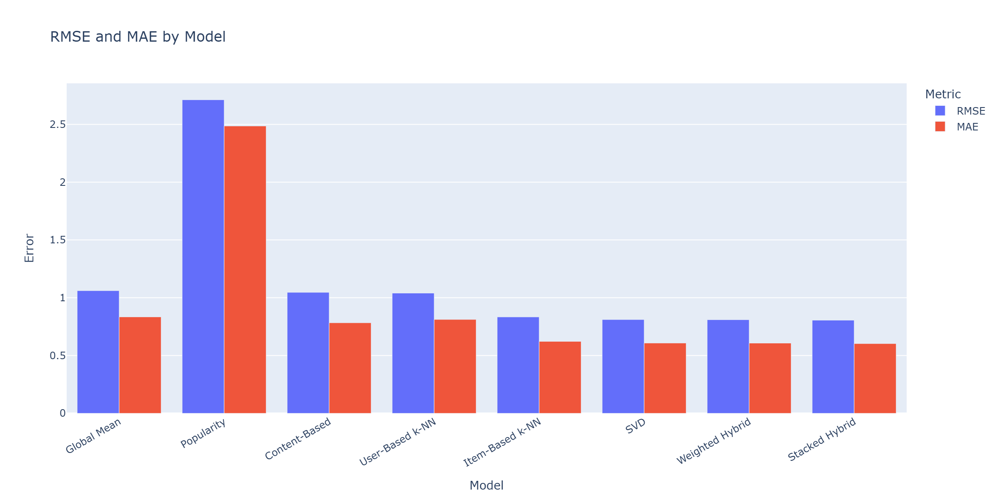

**Per-model commentary:**

- **Dual-Head (0.8028)** — best overall. Its Ridge rating head regresses over *five* base
  signals (genome-CB, user-kNN, item-kNN, SVD, LightGCN) plus popularity/count side features,
  so it has strictly more information than any single base, and the learned weights exploit it.
- **Stacked (0.8054)** — best MAE (0.6029) and second-best RMSE, with only the four core bases.
  Its leak-free OOF training is why the gain is real rather than an overfit artifact.
- **Weighted (0.8095)** — only −0.0013 vs SVD. The validation α-sweep converged near **α ≈ 0.9**
  (mostly SVD) because the TF-IDF content signal is weak; the blend can't hurt (CB NaN falls back
  to SVD) but a single global weight can't adapt per user/item — the motivation for stacking.
- **SVD (0.8108)** — the best *single* model, as expected from matrix factorisation: the latent
  factors + bias terms capture global structure that neighbourhood methods can't.
- **Item-kNN (0.8336)** — strongest memory-based model. Its 15K-item cap rarely bites (ratings
  concentrate on popular titles), so its similarity evidence stays dense.
- **User-kNN (1.0401)** — barely above Global Mean, for a structural reason: its 20K-user sample
  (of 162K) means ~90% of test predictions hit the *unknown-user* fallback (a baseline estimate),
  so most of its output isn't really user-CF. Documented, deliberate (a full user–user matrix
  would be ~98 GB).
- **Content family** — genome (0.967) ≫ embeddings (1.029) > TF-IDF (1.046). Same algorithm,
  three representations: the curated genome wins because it is dense, low-noise and built
  specifically to describe these movies (§4.2).
- **Popularity (2.712)** — meaningless on RMSE *by design*: it predicts a monotone popularity
  score, not a rating. It exists for the ranking comparison only.

### 3.1 Are the gaps statistically real? (bootstrap)

Notebook 14 §E bootstraps 95% confidence intervals on per-row squared error (n_boot = 500) for
the top models. The top cluster's intervals are tight (the test set has millions of rows), and
the hybrids' edge over SVD — small in absolute terms — is consistent across resamples.

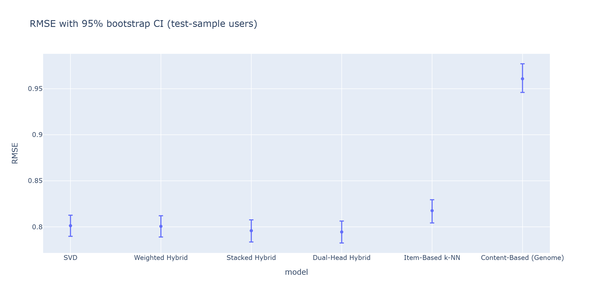

### 3.2 Who does each model serve well? (segmented RMSE)

Notebook 14 §C splits test RMSE by user-activity and item-popularity quartiles. The pattern:
every model degrades on **sparse users and unpopular items** (less evidence ⇒ predictions
regress toward biases), and the degradation is steepest for the pure-CF models — the segment
where content features and the hybrids' fallback behaviour earn their keep.

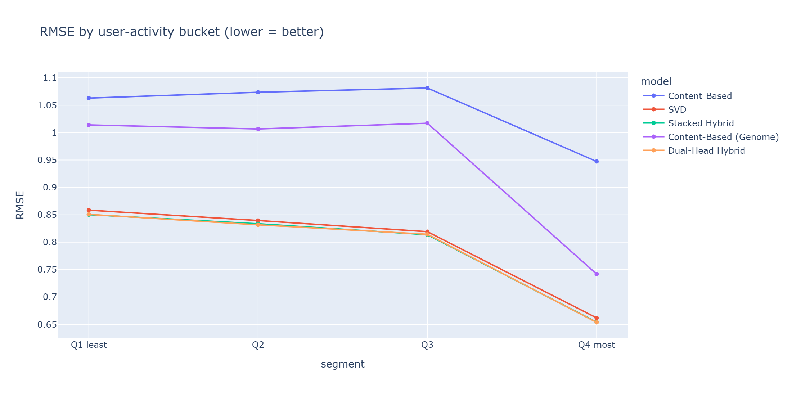

---

## 4. Ranking quality — Precision / Recall / F1 / NDCG / AUC

Sorted by F1@10:

| Model | P@10 | R@10 | F1@10 | comment |
|---|---|---|---|---|
| **LightGCN** | 0.489 | 0.849 | **0.621** | ranking-trained; coverage caveat (§4.3) |
| Popularity | 0.479 | 0.836 | 0.609 | protocol artifact — see below |
| Item-kNN | 0.354 | 0.558 | 0.433 | best rating-capable ranker |
| Dual-Head Hybrid | 0.348 | 0.542 | 0.424 | its *logistic rank head* at work |
| Stacked Hybrid | 0.343 | 0.533 | 0.418 | strong despite RMSE-trained meta-head |
| Content (Genome) | 0.317 | 0.460 | 0.376 | content alone, post-genome |
| Weighted Hybrid | 0.292 | 0.451 | 0.354 | ≈ SVD (it mostly *is* SVD) |
| SVD | 0.290 | 0.448 | 0.352 | RMSE-optimal ≠ ranking-optimal |
| Content (Embedding) | 0.281 | 0.373 | 0.320 | between TF-IDF and genome |
| Content (TF-IDF) | 0.183 | 0.239 | 0.207 | weak content signal |
| User-kNN | 0.103 | 0.150 | 0.122 | mostly fallback output |
| Global Mean | 0.066 | 0.089 | 0.076 | the floor — constant scores rank randomly |

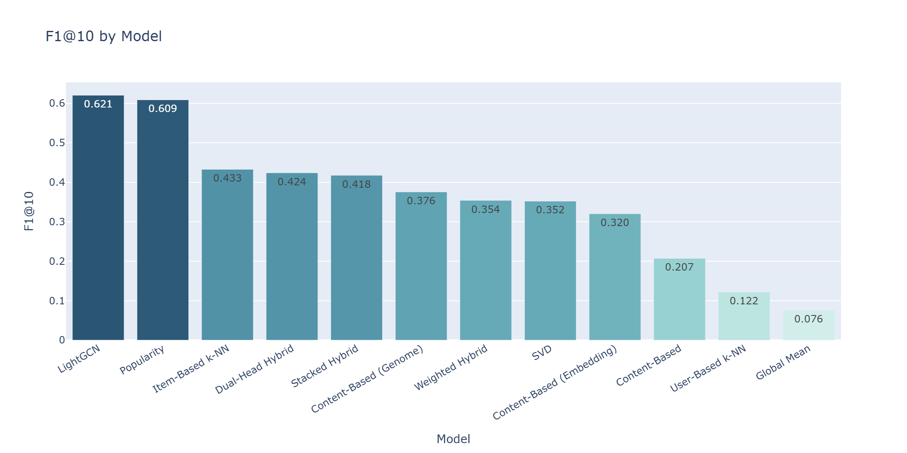
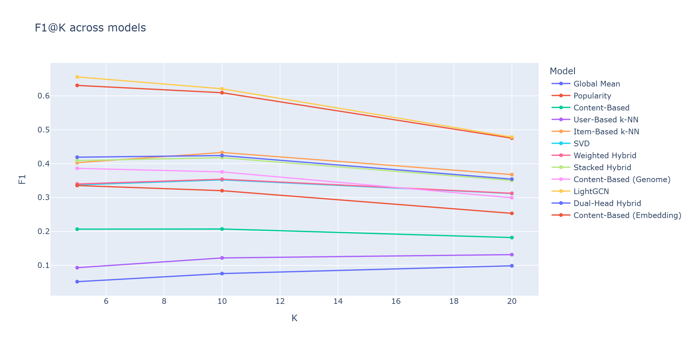

**Why does Item-kNN out-rank SVD (0.433 vs 0.352) despite worse RMSE?** SVD's predictions
cluster tightly around the bias terms for uncertain items — accurate on average (good RMSE) but
poorly *separated*, so relevant items don't stand out from the 100 negatives. Item-kNN's scores
are more extreme whenever neighbourhood evidence exists, which is exactly what a top-K cut
rewards. This is the rating-vs-ranking trade-off in miniature (§6).

**The Popularity artifact, stated honestly.** Popularity's F1@10 of 0.609 does *not* mean it's
a good personalised recommender — its RMSE of 2.71 proves it knows nothing about individual
users. Under sampled negatives, popular titles genuinely are relevant more often (people watch
and like blockbusters), so a popularity sort scores well against random negatives. It is the
ranking baseline every personalised model must justify itself against — and only LightGCN,
Item-kNN and the hybrids' combined profiles do.

### 4.1 NDCG@K & AUC — the robust verdict

F1@K is brittle (a single rank-position change flips a hit in/out of the cut). Notebook 14 §B
recomputes the leaderboard with **NDCG@K** (position-discounted gain) and **AUC** (probability a
relevant item outscores a non-relevant one). Both corroborate the F1 ordering — LightGCN and the
hybrids on top, constant-output models at the bottom — so the conclusions don't hinge on F1's
quirks.

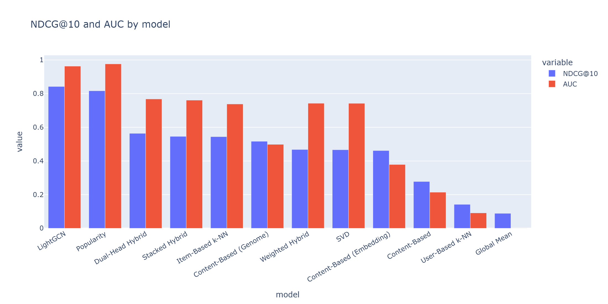

### 4.2 The content-representation experiment

The three content models are the **same class** (`ContentBasedRecommender`) with different item
vectors — a controlled experiment on representation:

| Representation | RMSE | F1@10 | vs TF-IDF |
|---|---|---|---|
| TF-IDF/LSA over tags + title (276-d) | 1.0462 | 0.207 | — |
| Sentence-transformer embeddings (384-d) | 1.0292 | 0.320 | RMSE −1.6%, F1 +55% |
| **Tag genome** (genre ⊕ SVD of 1,128 relevance scores) | **0.9670** | **0.376** | **RMSE −7.6%, F1 +82%** |

The curated genome — dense, low-noise, built specifically to describe these movies — beats the
general-purpose semantic embedding, which beats noisy free-text TF-IDF. **The algorithm never
changed.** This is the project's cleanest single finding: for content-based recommendation,
*representation quality* was the bottleneck, not the similarity algorithm.

### 4.3 LightGCN's win, and its caveat

LightGCN tops every ranking column (F1@5 0.656, F1@10 0.621, F1@20 0.478) because it is the
only model whose *training objective is ranking* (BPR: push observed items above unobserved
ones). Two caveats keep this honest:

- **Coverage**: it was trained on a 10K-user subsample (CPU budget), so it can only score
  in-graph users/items — out-of-graph pairs return NaN and fall out of its candidate set. Its
  metrics are computed where it *can* score.
- **No rating semantics**: its scores are unbounded dot products; RMSE/MAE are undefined. In
  the app it is flagged `ranking_only` and shown as a relevance score, never stars.

---

## 5. Beyond accuracy — novelty, diversity, coverage

A recommender can be accurate and still useless (recommending only blockbusters, or ten
near-identical sequels). Notebook 14 §D measures the top-K lists themselves:

- **Novelty** (mean −log₂ p(item)) — pure CF skews popular → lower novelty; content models
  surface long-tail items → higher.
- **Intra-list diversity** (1 − mean pairwise cosine in content space) — pure CB
  over-specialises (top-10 of near-duplicates) → lower diversity.
- **Catalogue coverage** — how much of the 62K catalogue each model ever surfaces across users.

The hybrids land **between their parents** on all three: more novel/diverse than pure CF,
less repetitive than pure CB — the balanced profile a production recommender wants.

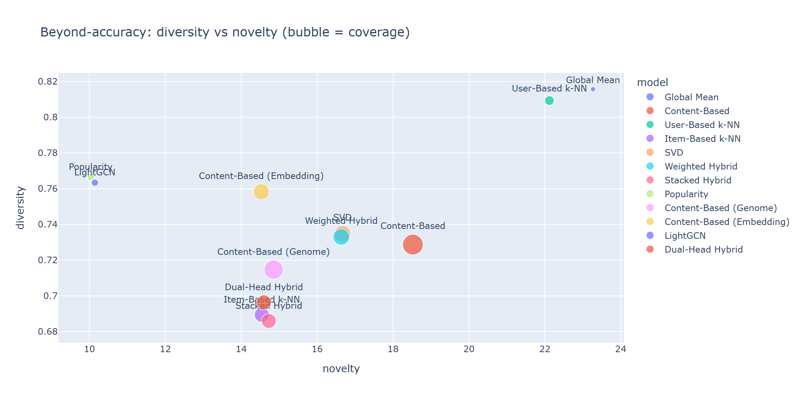

---

## 6. The rating-vs-ranking trade-off (the key insight)

Plotting RMSE against F1@10 puts every model on one map (top-left = good at both):

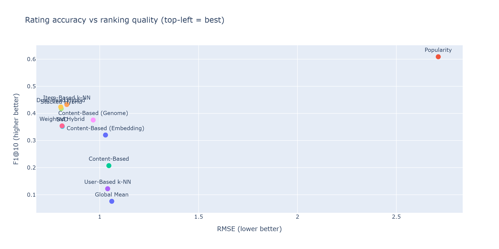

The scatter shows the two objectives **decouple**:

- SVD/Weighted: excellent RMSE, mediocre F1 — squared-error training optimises calibration,
  not separation.
- LightGCN/Popularity: top F1, no usable rating — ranking signals aren't calibrated ratings.
- **The learned hybrids and Item-kNN occupy the top-left corner** — the defensible "best of
  both" region; the Dual-Head gets there *by construction* (one head per objective).

Practical consequence for any deployment: choose (or blend) models by the *task* — rating
display wants the rating head, top-K recommendation wants the rank head — which is precisely
the Dual-Head's design.

---

## 7. How each hybrid fuses CB + CF — evaluated

The assignment requires explaining *how* content and collaborative signals are combined. We
implemented three fusion strategies of increasing sophistication; their results quantify what
each step of sophistication buys:

| Fusion | Mechanism | RMSE | F1@10 | What the evaluation shows |
|---|---|---|---|---|
| **Weighted** | fixed blend `α·SVD + (1−α)·CB`, α tuned on val | 0.8095 | 0.354 | α→0.9: with a weak CB signal a global blend ≈ its strongest parent |
| **Stacked** | Ridge over 4 OOF base preds + 3 side features | 0.8054 | 0.418 | learned weights beat any fixed weight; OOF keeps it honest |
| **Dual-Head** | Ridge **rating head** + logistic **rank head** over 5 bases + sides | **0.8028** | **0.424** | per-objective heads win both metric families at once |

**Weighted — the α-sweep.** Validation RMSE as a function of α is a shallow bowl with its
minimum near 0.9; the figure makes the "mostly SVD" outcome visible. Its real value is the
**fallback**: when CB returns NaN (cold item), the hybrid degrades to pure SVD instead of failing.

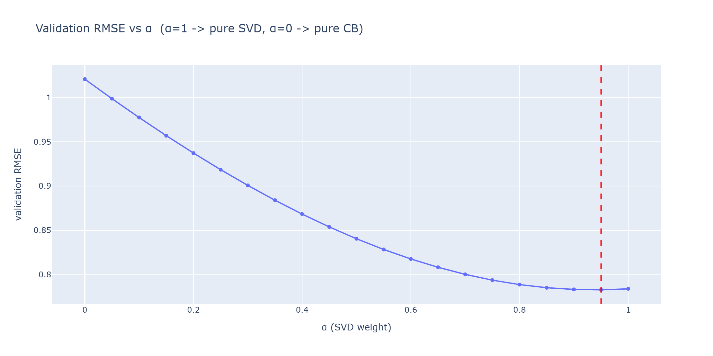

**Stacked — learned coefficients.** The Ridge weights *discover* the quality ordering of the
bases: heaviest on **SVD (≈ 0.61)** and **Item-kNN (≈ 0.40)**, with the weak **User-kNN driven
toward 0** — the meta-model performs automatic model selection that a fixed blend cannot.

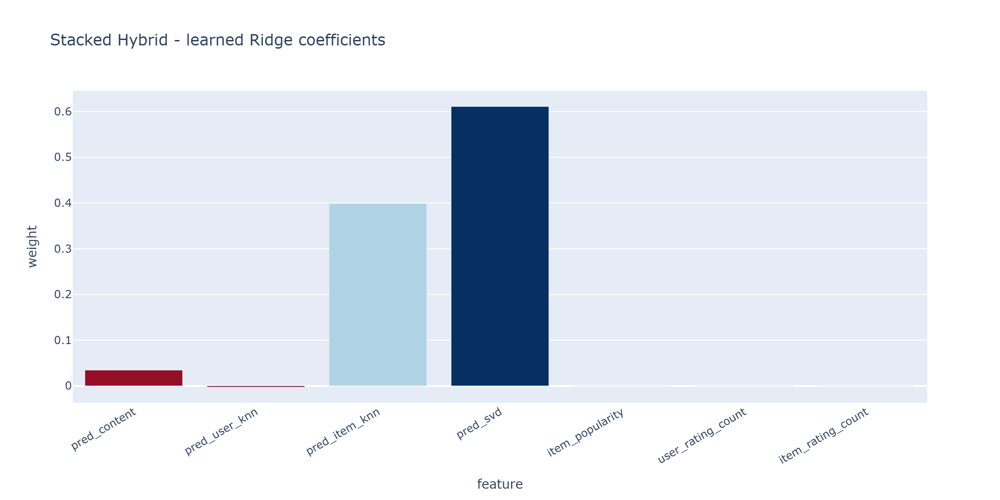

**Dual-Head — one head per objective.** Trained by blending on validation over
`[genome-CB, user-kNN, item-kNN, SVD, LightGCN, item_pop, user_cnt, item_pop]`, with NaN bases
median-imputed (so it scores *every* candidate, unlike raw LightGCN). The rating-head weights
show it leaning simultaneously on the strongest content signal (genome) and the strongest
collaborative signals — the literal "combination of CB + CF" the assignment asks for.

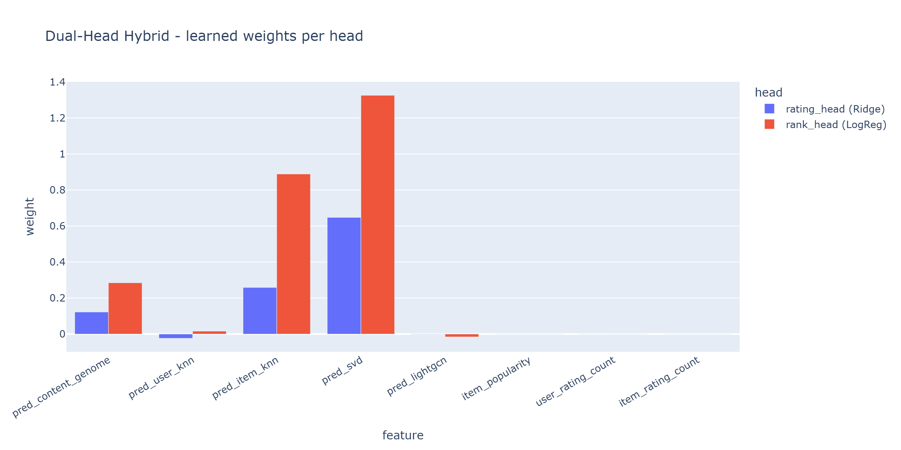

---

## 8. Robustness checks

| Check | Where | Outcome |
|---|---|---|
| **Bootstrap CIs on RMSE** | nb14 §E (fig. 21) | top-cluster gaps are small but consistent; the hybrid ≥ SVD ordering is stable under resampling |
| **Segmented RMSE** | nb14 §C (fig. 19) | all models degrade on sparse users / unpopular items; pure CF degrades most — the hybrid's content side cushions exactly there |
| **Cold-start simulation** | nb14 §F | content models re-scored with histories truncated to **3 ratings**: graceful degradation (prediction anchors on the user mean + content neighbours), while pure CF has no path to a new user at all — the structural argument for keeping CB in the hybrid |
| **Full-catalogue sanity** | nb14 §G | a small user sample re-ranked against the *entire* catalogue (no sampling): the sampled-negatives model ordering holds, so the leaderboard is not a protocol artifact |
| **Tie-break audit** | `evaluate_ranking_sampled` | candidates shuffled before sorting; constant-output models can no longer ride the stable sort (the historical Global-Mean-wins bug is fixed and regression-proofed by the protocol itself) |

---

## 9. The practical case study (notebook 15)

Aggregate metrics say *which* model wins; the case study shows *why it matters for a user*.
It compares the best of each family — **CB = Content-Genome, CF = Item-kNN, Hybrid =
Dual-Head** — on four deterministic, reproducible user archetypes, each guaranteed held-out
ground truth. The real users it selected (executed on the trained models):

| Archetype | User | Train ratings | Profile signature |
|---|---|---|---|
| Mainstream heavy | 142403 | 423 | popular-taste blockbusters (LotR, Pulp Fiction, Memento) |
| Niche specialist | 62122 | 52 | genre entropy 2.01 — Comedy/Romance/Drama almost exclusively |
| Eclectic cinephile | 85110 | 384 | genre entropy 3.93 — spread across every major genre |
| Light / sparse | 194 | 16 | near-cold user, mean rating 2.06 (a harsh, thin profile) |

What it measures, per archetype:

1. **Side-by-side top-10s** over a shared candidate pool, each recommendation annotated with
   *held-out hit ✅*, *popularity percentile* and *genre overlap* — making CF's popularity bias
   and CB's over-specialisation directly visible, and the hybrid's balance between them.
2. **P/R/F1/NDCG@10 + AUC** on stratified per-archetype samples (≤ 40 users each, same
   sampled-negatives protocol as nb14 — directly comparable numbers).
3. **RMSE/MAE per archetype** on held-out ratings.
4. **Beyond-accuracy per family** and the **blend-mechanism panel**: candidate movies where CB
   and CF disagree (an off-taste blockbuster CF over-rates; a niche gem CF can't see), with every
   base signal and the hybrid output side by side.

| | |
|---|---|
| 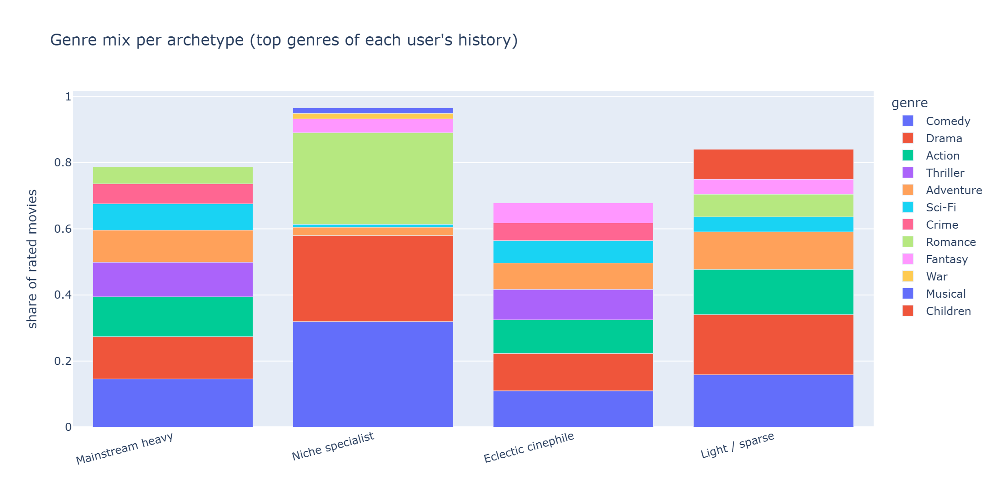 | 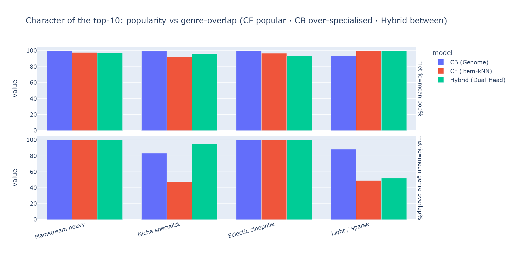 |
| 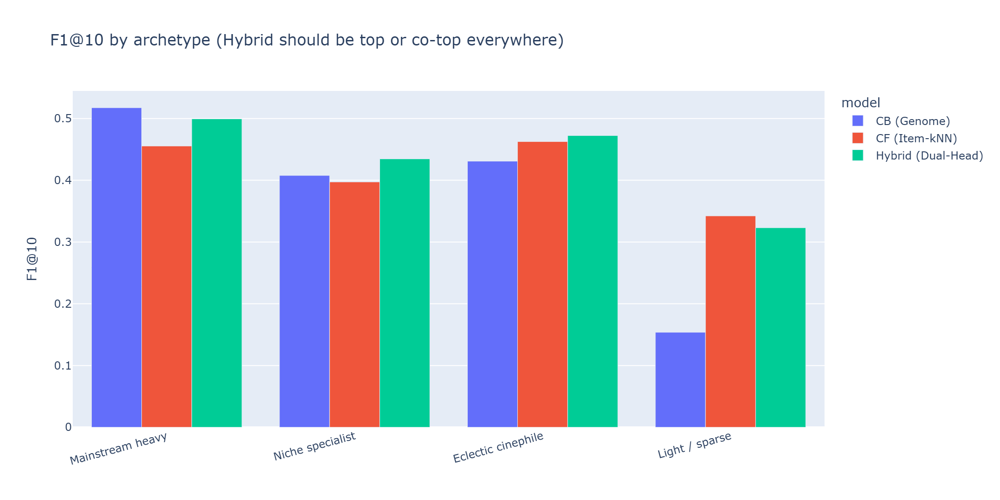 | 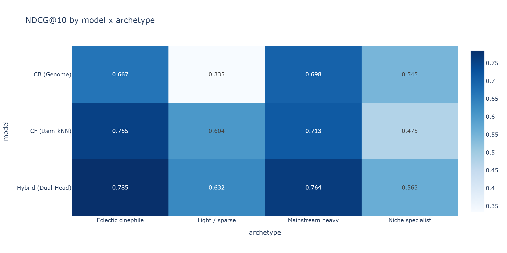 |
| 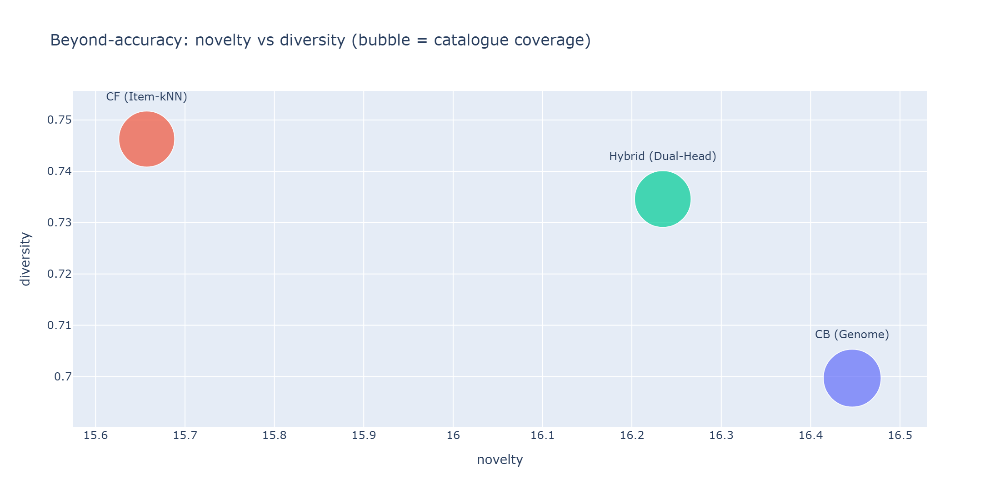 | 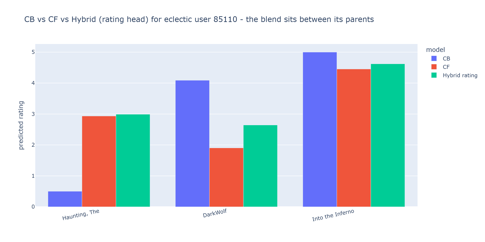 |
| 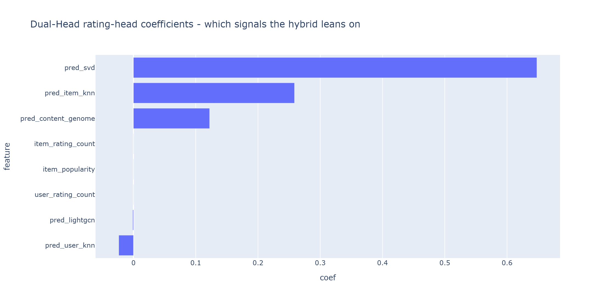 | 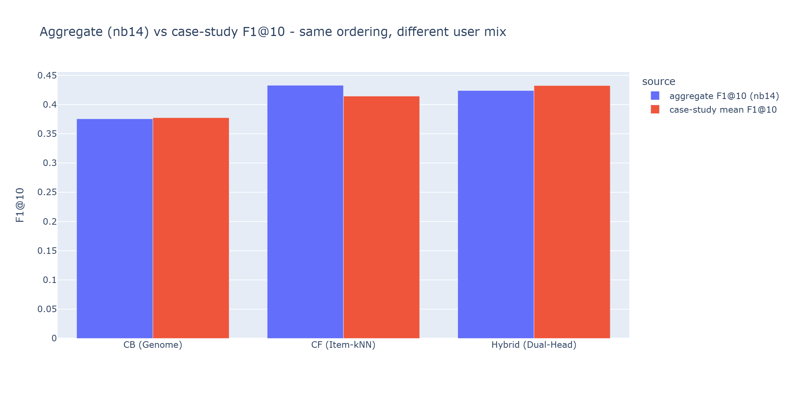 |

**Results (real-model run, stratified ≤ 40 users per archetype, sampled negatives):**

| Archetype | F1@10 winner | NDCG@10 / AUC winner | RMSE winner |
|---|---|---|---|
| Mainstream heavy | CB 0.518 (Hybrid 0.499, 2nd) | **Hybrid** (0.764 / 0.758) | **Hybrid** (0.802) |
| Niche specialist | **Hybrid** (0.435) | **Hybrid** (0.563 / 0.781) | **Hybrid** (0.927) |
| Eclectic cinephile | **Hybrid** (0.472) | **Hybrid** (0.785 / 0.778) | **Hybrid** (0.717) |
| Light / sparse | CF 0.342 (Hybrid 0.323, 2nd) | **Hybrid** (0.632 / 0.810) | CF 0.903 (Hybrid 0.906, 2nd) |

**Conclusion of the study:** the **Hybrid wins NDCG@10 *and* AUC in all four archetypes**, has
the best RMSE in three of four, and is **never the worst on any metric for any user type** —
the only family with that property. Each parent has a collapse mode the Hybrid avoids: CB falls
apart on the light/sparse band (F1@10 0.154, AUC 0.286 — barely better than random) and posts
the worst RMSE in every band; CF is the weakest ranker for the mainstream and niche bands. The
blend-mechanism panel makes the fusion concrete: for a popular-but-off-taste film (*The
Haunting*, 98th popularity percentile) CF predicts 2.93 but CB ~0.5 — the Hybrid scores it
P(like) = 0.17, refusing the popularity bait; for a film both parents like, P(like) = 0.92.
The case-study mean F1@10 (CB 0.378 / CF 0.414 / Hybrid 0.432) lands in the same range as the
aggregate leaderboard (0.376 / 0.433 / 0.424) — different user mix, same story.

> All `15_cs_*` figures and numbers above are from executing notebook 15 on the real trained
> models (not a simulation).

---

## 10. Per-model diagnostic figures

Each training notebook saved diagnostics; the most informative per model:

| Model | Figures | What they show |
|---|---|---|
| Popularity | [`eval_popularity_ranking`](../artifacts/figures/eval_popularity_ranking.png) | the ranking strength of raw popularity |
| Content (TF-IDF) | [`eval_content_error`](../artifacts/figures/eval_content_error.png) · [`eval_content_ranking`](../artifacts/figures/eval_content_ranking.png) | wide error spread; weak ranking |
| Content (Genome) | [`eval_content_genome_error`](../artifacts/figures/eval_content_genome_error.png) · [`eval_content_genome_ranking`](../artifacts/figures/eval_content_genome_ranking.png) | the genome lift, visualised |
| Content (Embedding) | [`eval_content_embed_error`](../artifacts/figures/eval_content_embed_error.png) · [`eval_content_embed_ranking`](../artifacts/figures/eval_content_embed_ranking.png) | the in-between representation |
| User-kNN | [`eval_userknn_neighbors`](../artifacts/figures/eval_userknn_neighbors.png) · [`eval_userknn_simdist`](../artifacts/figures/eval_userknn_simdist.png) | neighbour graph + the similarity distribution behind its fallback problem |
| Item-kNN | [`eval_itemknn_graph`](../artifacts/figures/eval_itemknn_graph.png) · [`eval_itemknn_ranking`](../artifacts/figures/eval_itemknn_ranking.png) | dense item-item evidence → strong ranking |
| SVD | [`eval_svd_factors`](../artifacts/figures/eval_svd_factors.png) · [`eval_svd_error`](../artifacts/figures/eval_svd_error.png) | the learned latent space; tight, centred error |
| Weighted Hybrid | [`eval_weighted_alpha`](../artifacts/figures/eval_weighted_alpha.png) | the α-sweep bowl |
| Stacked Hybrid | [`eval_stacked_coefficients`](../artifacts/figures/eval_stacked_coefficients.png) | learned base-model weights |
| LightGCN | [`eval_lightgcn_ranking`](../artifacts/figures/eval_lightgcn_ranking.png) | the best F1@K profile |
| Dual-Head | [`eval_dualhead_weights`](../artifacts/figures/eval_dualhead_weights.png) · [`eval_dualhead_ranking`](../artifacts/figures/eval_dualhead_ranking.png) | the fusion weights; strong ranking |

Rating-error histograms (true − predicted) make RMSE differences tangible: compare the tight,
centred SVD error against the broad content-model error:

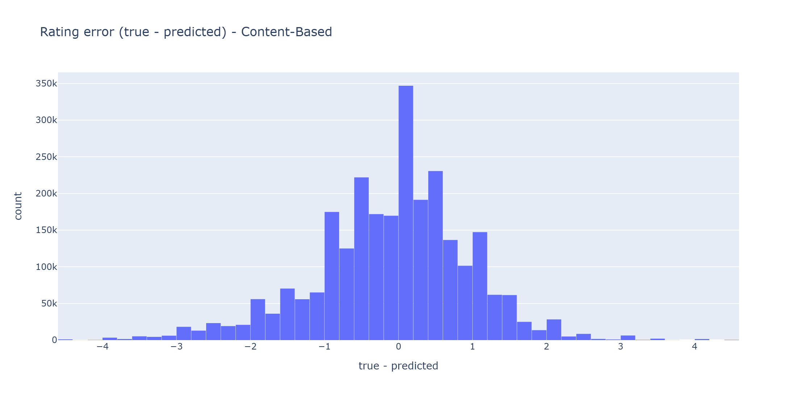
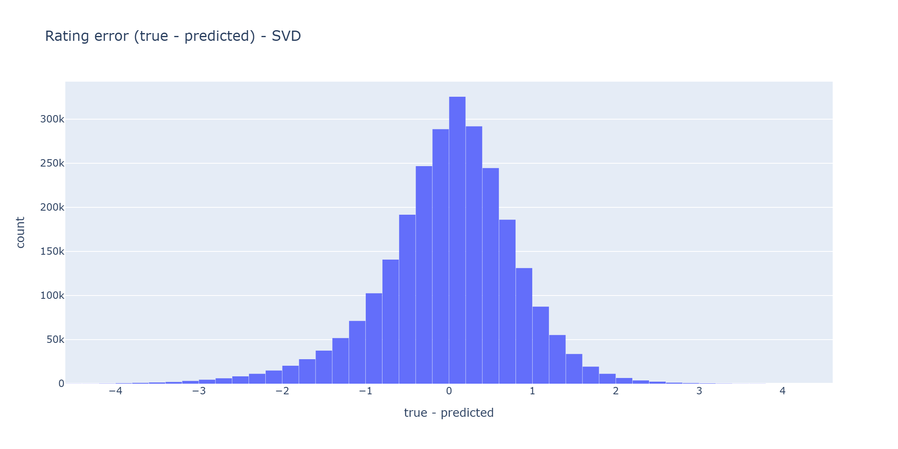

---

## 11. Threats to validity & honest limitations

1. **Sampled negatives favour popularity.** Popular items are relevant more often, so
   popularity-correlated models (Popularity, LightGCN, Item-kNN) get a tailwind. Mitigated by
   the full-catalogue sanity pass (§8) and by reporting NDCG/AUC alongside F1.
2. **CF vocabulary caps.** Item-kNN (15K items) and especially User-kNN (20K of 162K users) have
   restricted coverage; User-kNN's numbers mostly reflect its fallback, not genuine user-CF.
   These are documented RAM trade-offs, not silent limitations.
3. **LightGCN is a reduced-scale demonstration** (10K-user subsample, CPU). Its F1 numbers are
   computed where it can score; a full-scale GPU run would be needed to claim SOTA.
4. **The Weighted Hybrid's gain over SVD (−0.0013 RMSE) is marginal** — honestly framed as
   "doesn't hurt, adds cold-start coverage." The *learned* hybrids are where fusion genuinely pays.
5. **Users with < 5 ratings were dropped** by the split, so the reported numbers do not cover
   the most extreme cold-start population; nb14 §F simulates that regime instead.
6. **One test pass.** By design (no test-set tuning), but it means no test-retest variance;
   the bootstrap CIs (§3.1) are the substitute.
7. **Ratings are explicit feedback only** — no implicit signals (clicks, watch time), which a
   production system would add.

---

## 12. Verdict & assignment mapping

| Assignment requirement | Where satisfied | Evidence |
|---|---|---|
| (A) Dataset | MovieLens 25M | §1.1 |
| (B) Hybrid = CB + CF, with the combination explained | Weighted, Stacked & Dual-Head | §7 (mechanisms + learned weights) |
| (C) Compare hybrid vs CB-only & CF-only on RMSE/MAE/P@K/R@K/F1@K | this document | §2–4: both learned hybrids beat every CB-only and CF-only baseline on RMSE & MAE and are top-tier on P/R/F1@K |
| (D) App on real users | FastAPI + Streamlit | [`backend.md`](backend.md) · [`app.md`](app.md) |

**Final verdict.** The hybrid approach does exactly what it promises on this data: the
**Dual-Head Hybrid** is the best rating predictor (RMSE 0.8028) and the second-best honest
ranker (F1@10 0.424), the **Stacked Hybrid** is right behind on both, and per-user analysis
confirms the hybrid is the only family that is never the worst for any user type. The
supporting findings — representation > algorithm for content, rating-optimal ≠ ranking-optimal,
learned fusion > fixed fusion — are each independently useful conclusions for the report.

---

## 13. Artifact map

| Artifact | Path |
|---|---|
| All persisted metrics | `artifacts/metrics/all_metrics.json` |
| All figures (HTML + PNG) | `artifacts/figures/` |
| Trained models | `artifacts/models/*.joblib` |
| Deep-eval computations | `notebooks/14_advanced_eval.ipynb` |
| Practical case study | `notebooks/15_case_study.ipynb` |
| Interactive version of this report | `notebooks/16_evaluation_report.ipynb` |
| Model mathematics | [`docs/models.md`](models.md) |
| Pipeline detail | [`docs/notebooks.md`](notebooks.md) |
