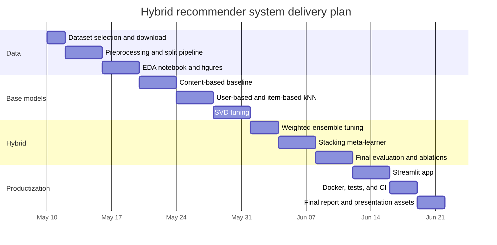

# Grade-Maximizing Plan for a Hybrid Recommender System

## Executive Summary

The strongest final plan for this assignment is to build and report a hybrid recommender on urlMovieLens 25Mturn0search2, while optionally using urlMovieLens latest-smallturn0search4 only for smoke tests and UI prototyping. MovieLens 25M is a stable benchmark with explicit 0.5–5.0 ratings, free-text tags, and tag-genome metadata; by contrast, GroupLens explicitly labels the “latest” datasets as changing over time and not appropriate for reporting research results. That combination makes 25M the best single dataset for a grade-maximizing submission: it supports a fair comparison of content-based, user-based CF, item-based CF, matrix factorization, and two explicit hybrid fusion methods, while giving you richer content features than MovieLens 1M. citeturn1view3turn18view0turn1view1turn1view4turn1view2turn16view1

The recommended modeling stack is straightforward and defensible. Implement a **content-based predictor** from item features derived from genres, tags, and title embeddings; implement **three collaborative baselines** using user-based k-NN, item-based k-NN, and SVD matrix factorization; then implement **two hybrids**: a weighted score ensemble and a stacking meta-learner trained on out-of-fold base-model predictions. This gives you breadth for the report and depth for the final comparison. It also aligns well with the capabilities of urlSurpriseturn2search4 for explicit-feedback k-NN and SVD; Surprise explicitly states that content-based and implicit-feedback methods are out of scope, so the content model should be implemented separately with urlscikit-learnturn3search9 and your own code. citeturn12view0turn4view0turn4view1turn15view0turn15view2

For evaluation, use a **user-wise temporal split** with train/validation/test partitions, keep the split identical across all models, and report **RMSE, MAE, Precision@K, Recall@K, and F1@K**. A strong and easy-to-defend choice is relevance threshold **rating >= 4.0** and K values **5, 10, and 20**, with the model selected primarily by validation F1@10 subject to non-inferior RMSE/MAE. This creates a rigorous story for both rating prediction and top-N recommendation, which is exactly what most instructors want to see in this type of assignment. citeturn14search1turn7view0turn3search0turn3search4turn17search0turn17search8

The engineering finish that usually separates a solid project from an excellent one is reproducibility and presentation: package the project cleanly, add unit tests, ship a minimal urlStreamlit appturn3search3, containerize with urlDocker Composeturn9search0, and run tests in urlGitHub Actionsturn9search1. A submission with a rigorous experimental section, a clean repository, and a working demo is much easier to grade highly. citeturn4view5turn9search0turn9search1turn9search2

## Dataset Choice

Use **MovieLens 25M** as the final experimental dataset. The official README reports 25,000,095 ratings and 1,093,360 tag applications across 62,423 movies from 162,541 users, stored in `ratings.csv`, `movies.csv`, `tags.csv`, `genome-scores.csv`, `genome-tags.csv`, and `links.csv`. Ratings are explicit 0.5–5.0 stars with half-star increments; users are anonymized, and all included users have at least 20 ratings. This is almost ideal for your rubric because it gives you explicit ratings for RMSE/MAE and item metadata for a strong content model. citeturn18view0turn1view3

Use **latest-small only as a developer convenience dataset**, not as the final benchmark. GroupLens describes it as a development dataset, and its README says it is not appropriate for shared research results. It is still very useful for fast iteration because it is small, CSV-based, and includes ratings, tags, and recent movies. If you absolutely need a smaller final benchmark for time reasons, then **MovieLens 1M** is the best fallback because it is stable and compact, but it has no tags in the historical summary, so your content-only model will be weaker and less interesting. citeturn1view4turn1view1turn1view2turn16view1

### Dataset options

| Dataset option | Approximate scale | Metadata useful for content model | Main advantage | Main drawback | Recommendation |
|---|---:|---|---|---|---|
| MovieLens latest-small | 100k ratings, 610 users, 9.7k movies | Genres, tags, titles | Fast prototyping | Non-archival, not for final reported results | Prototype only |
| MovieLens 1M | 1.0M ratings, 6k users, 4k movies | Genres, titles | Stable and easy for all CF baselines | No tags; weaker content signal | Best fallback |
| MovieLens 20M | 20M ratings, 138k users, 27k movies | Genres, tags, tag genome, titles | Strong stable benchmark | Heavier tuning/runtime | Excellent alternative |
| MovieLens 25M | 25M ratings, 162k users, 62k movies | Genres, tags, tag genome, titles | Best blend of scale and metadata | k-NN models heavier | Final choice |
| Book-Crossing | 1.15M ratings, 279k users, 271k books | Titles plus some demographics | Interesting alternative domain | Mixed explicit/implicit, noisier catalog | Not recommended here |
| Jester | 4.1M ratings, 73k users, 100 jokes | Very limited item metadata | Dense collaborative benchmark | Weak content side, only 100 items | Not recommended here |
| Amazon Reviews 2018 | 233.1M reviews | Very rich text/metadata/images | Extremely realistic and rich | Much more preprocessing and project risk | Overkill for this assignment |

The scale and metadata summary above comes from the official GroupLens dataset pages and README files for MovieLens, the GroupLens page for Book-Crossing, the Berkeley Jester dataset page, the UCSD Amazon review dataset page, and the KDnuggets overview of recommender-system datasets. For this specific coursework, movies are the most convenient domain because the assignment explicitly asks for a hybrid of content-based and collaborative methods, and MovieLens is the cleanest benchmark for doing both without external scraping. citeturn1view4turn1view1turn1view3turn18view0turn20view0turn20view1turn20view2turn1view0

A subtle but important advantage of MovieLens 25M is that you can construct a surprisingly strong content model **without leaving the official dataset**. Besides `genres` and free-text `tags`, the dataset includes tag-genome relevance scores. The title field also contains release years, but the README warns that titles may contain errors or inconsistencies, so title text should help the model but should not be the only content signal. citeturn18view0

## Data Preparation and Exploratory Analysis

The preprocessing pipeline should produce **one canonical interaction table** and **one canonical item-feature matrix** that every model uses. Start from `ratings.csv`, `movies.csv`, `tags.csv`, and optionally `genome-scores.csv`/`genome-tags.csv`. Parse `title` into `clean_title` and `year`, split the pipe-separated `genres` into binary indicators, aggregate all user tags per movie into a single text field, and join tag-genome features where available. Because MovieLens user IDs are anonymous and the dataset includes no demographic information, your hybrid will mainly address **item cold start and sparse-user settings**, while true new-user cold start in the app should be handled through onboarding ratings rather than user metadata. citeturn18view0

For text features, use a layered approach rather than betting on one representation. A strong default is: genres as a multi-hot sparse vector; aggregated tags and cleaned titles converted to TF-IDF; optional dimensionality reduction with TruncatedSVD; and an optional dense sentence embedding for title-based semantics. Scikit-learn documents that TF-IDF uses L2 normalization by default, where cosine similarity becomes a normalized dot product, and that TruncatedSVD works efficiently on sparse TF-IDF matrices as latent semantic analysis. Sentence Transformers are explicitly designed to generate dense embeddings for semantic similarity, and the `all-MiniLM-L6-v2` model card describes it as a short-text encoder that outputs 384-dimensional vectors. citeturn3search1turn3search5turn10search2turn10search4turn3search2

A grade-maximizing content pipeline on MovieLens 25M should therefore create three item-feature variants and compare them on validation: **genres-only**, **genres + TF-IDF over title and tags**, and **genres + TF-IDF + title embeddings + optional genome-derived pseudo-tags**. If you want one clean “best” version for the final report, the safest choice is genres + TF-IDF(tags + title) plus a small dense title embedding block, because that combines interpretable metadata with semantic smoothing and remains easy to explain. citeturn18view0turn3search1turn3search5turn10search4

### Preprocessing checklist

- Load raw CSVs and enforce dtypes early.
- Deduplicate ratings if needed and sort interactions by `userId, timestamp`.
- Extract `year` from `title` with regex; build `clean_title`.
- Convert `genres` to multi-hot columns.
- Aggregate tags per movie into one document; lower-case and strip punctuation.
- If using tag genome, keep top-N genome tags per movie as pseudo-text **or** use the numerical relevance vector directly where coverage exists.
- Map raw IDs to contiguous integer IDs for efficient sparse matrices.
- Persist processed tables as Parquet and persist split manifests so every model sees the same train/validation/test rows.

### Exploratory data analysis checklist

- Plot the rating histogram and user/item long-tail distributions.
- Compute matrix sparsity: `1 - #ratings / (#users * #items)`.
- Inspect percentiles of ratings per user and per item.
- Show genre frequency and co-occurrence.
- Measure tag coverage across movies and missingness of genome features.
- Visualize rating timestamps to justify a temporal split.
- Compare popularity by mean rating, count, and a weighted popularity score.
- Report how many users and items appear in train, validation, and test under your split.
- Inspect a few movies with noisy or ambiguous titles to justify title cleaning.

The EDA section is not filler. It should directly answer design questions such as whether k-NN will struggle with sparsity, how much tags actually help, whether genome coverage is sufficient to include, and whether the newest ratings differ meaningfully from the older ones. This section also gives you figures for the report and for the app’s “dataset overview” tab. citeturn18view0turn14search1

### Item feature construction sketch

The content model should be implemented outside Surprise, because Surprise is explicitly for explicit rating prediction and does not support content-based data. A clean implementation pattern is shown below. citeturn12view0turn3search1turn3search5turn10search2

```python
import pandas as pd
from scipy.sparse import csr_matrix, hstack
from sklearn.feature_extraction.text import TfidfVectorizer
from sklearn.decomposition import TruncatedSVD

# movies: movieId, title, genres
# tags_agg: movieId -> aggregated tag text

movies["clean_title"] = (
    movies["title"]
    .str.replace(r"\(\d{4}\)$", "", regex=True)
    .str.lower()
    .str.strip()
)

genre_X = movies["genres"].str.get_dummies(sep="|").astype("float32")
text_corpus = (
    movies["clean_title"].fillna("") + " " +
    tags_agg.reindex(movies["movieId"]).fillna("")
)

tfidf = TfidfVectorizer(min_df=5, ngram_range=(1, 2), sublinear_tf=True)
text_X = tfidf.fit_transform(text_corpus)

# optional compression for memory/speed
svd = TruncatedSVD(n_components=256, random_state=42)
text_X_reduced = csr_matrix(svd.fit_transform(text_X))

item_features = hstack([csr_matrix(genre_X.values), text_X_reduced]).tocsr()
movie_index = pd.Series(range(len(movies)), index=movies["movieId"].values)
```

## Modeling Strategy

The report should compare **one naive baseline**, **one content-only family**, **three collaborative models**, and **two hybrids**. Structurally, that gives you a strong experimental section: simple baseline, interpretable baseline, classic CF baselines, and advanced fusion. For the graded assignment, the most important point is that **every model must output comparable test predictions** so that RMSE/MAE and top-K metrics can be computed on the same split. citeturn4view0turn4view1turn7view0

### Model variants

| Variant | Library / implementation | Output type | Why include it | Keep in final comparison |
|---|---|---|---|---|
| Global mean / popularity | custom | rating or ranking | Sanity baseline | Yes |
| Content-based genres-only | custom + scikit-learn | rating estimate | Minimal interpretable content model | Yes |
| Content-based full features | custom + scikit-learn + embeddings | rating estimate | Strong content baseline | Yes |
| User-based CF | Surprise k-NN | rating estimate | Classic user-user baseline | Yes |
| Item-based CF | Surprise k-NN | rating estimate | Stronger movie-domain baseline in many cases | Yes |
| Matrix factorization / SVD | Surprise SVD | rating estimate | Primary CF model | Yes |
| Weighted hybrid | custom | rating estimate | Main hybrid method | Yes |
| Stacked hybrid | scikit-learn meta-learner | rating estimate | Advanced hybrid method | Yes |
| LightFM hybrid | LightFM | ranking / score | Bonus appendix model | Optional |
| implicit ALS / BPR | implicit | ranking / score | Bonus implicit-feedback appendix | Optional |

The collaborative capabilities in the table come from the official Surprise documentation for k-NN and SVD, the LightFM documentation and paper, and the implicit documentation. The important rubric-driven distinction is that Surprise is aimed at **explicit ratings** and already supports the exact CF family you need, while `implicit` is specifically for **implicit-feedback datasets** and therefore belongs only in an appendix experiment if you want bonus depth. citeturn4view0turn4view1turn12view0turn7view2turn7view3turn16view0turn4view4

### Content-based recommender

For fair comparison with RMSE/MAE, do **not** make the content model a pure ranking-only cosine similarity scorer. Instead, build a **content-similarity item-item model** that predicts ratings using the user’s own ratings on content-similar items. This gives you a true content-based predictor.

A strong formulation is:

\[
\text{sim}(i,j) = \cos(x_i, x_j)
\]

\[
\hat r^{CB}_{u,j} = \bar r_u +
\frac{\sum_{i \in N_u^L(j)} \text{sim}(i,j)\,(r_{u,i} - \bar r_u)}
{\sum_{i \in N_u^L(j)} |\text{sim}(i,j)| + \epsilon}
\]

where \(x_i\) is the item feature vector, \(\bar r_u\) is the user mean rating, and \(N_u^L(j)\) is the top-L content-similar items that user \(u\) has rated. This is easy to explain in the report: “I recommend an item because it is content-similar to items the user rated highly.” The features behind \(x_i\) can be genres, TF-IDF title/tag features, reduced text factors, or dense title embeddings. citeturn3search5turn3search1turn10search2turn10search4turn18view0

Recommended hyperparameters for the content model:

- feature set: `{genres}`, `{genres + title}`, `{genres + title + tags}`, `{genres + title + tags + genome}`
- TF-IDF `ngram_range`: `(1,1)` or `(1,2)`
- `min_df`: `5, 10, 20`
- reduced text dimensions: `128, 256, 512`
- neighborhood size `L`: `20, 50, 100`
- content-feature block weights: especially relative weights for genres, text, embeddings
- user-centering on/off: raw rating vs `(rating - user_mean)`

### Collaborative filtering models

For user-based and item-based CF, use Surprise k-NN algorithms rather than implementing them from scratch. Surprise’s k-NN documentation defines both user-based and item-based prediction forms and exposes the `user_based` switch in `sim_options`; the same documentation also exposes stronger variants such as `KNNWithMeans` and `KNNBaseline`. For explicit ratings, these are better baselines than a bare KNNBasic implementation. citeturn4view0

For matrix factorization, use Surprise SVD as the main CF model. The documented prediction form is \(\hat r_{ui} = \mu + b_u + b_i + q_i^T p_u\), trained with regularized SGD, and Surprise exposes the exact hyperparameters you need for coursework-level tuning: latent factors, epochs, learning rates, and regularization. Surprise also provides `cross_validate` and `GridSearchCV`, which makes it ideal for the rigor the report should show. citeturn4view1turn15view0turn15view2

Recommended hyperparameters for collaborative models:

- **User-based k-NN**
  - algorithm: `KNNWithMeans` or `KNNBaseline`
  - `k`: `20, 40, 80, 120`
  - `min_k`: `1, 3, 5, 10`
  - similarity: `cosine`, `msd`, `pearson`, `pearson_baseline`
  - `user_based=True`

- **Item-based k-NN**
  - same options as above
  - `user_based=False`

- **SVD**
  - `n_factors`: `50, 100, 200`
  - `n_epochs`: `20, 40, 80`
  - `lr_all`: `0.002, 0.005, 0.01`
  - `reg_all`: `0.02, 0.05, 0.1`
  - `biased=True`

If you want one high-confidence collaborative baseline order for the final write-up, use **item-based k-NN** and **SVD** as the principal CF comparators, and keep **user-based k-NN** mainly to satisfy the “user-based/item-based” coverage requirement. In movie data, item-based models are often easier to explain and present than user-user neighbors, while SVD is your strongest explicit latent-factor baseline. citeturn4view0turn4view1

### Hybrid fusion methods

The first hybrid should be a **weighted score ensemble** because it is easy to explain, easy to ablate, and directly answers the assignment’s request to explain how the two techniques were combined. Keep the primary hybrid simple:

\[
\hat r^{H1}_{u,j} = \alpha \hat r^{SVD}_{u,j} + (1-\alpha)\hat r^{CB}_{u,j}
\]

Then test an extended variant if useful:

\[
\hat r^{H1+}_{u,j} =
\alpha \hat r^{SVD}_{u,j} +
\beta \hat r^{CB}_{u,j} +
\gamma \hat r^{ItemKNN}_{u,j} +
\delta \text{Pop}(j)
\]

with non-negative weights summing to 1. Tune the weights on validation, not on test. For the report, this is the cleanest main hybrid because the contribution of each component is transparent. citeturn4view1turn4view0

The second hybrid should be **stacking with a meta-learner**, because it is the most convincing “advanced” extension you can add without derailing the project. Train base models first, generate **out-of-fold** predictions on the training pool, and use those predictions as features for a simple meta-model such as `Ridge`, `ElasticNet`, or `GradientBoostingRegressor`. A very strong meta-feature set is:

- `pred_content`
- `pred_user_knn`
- `pred_item_knn`
- `pred_svd`
- item popularity score
- user interaction count
- item interaction count
- content coverage flags, such as “has tags” or “has genome features”

Then fit the meta-model to predict the true rating. This usually gives a more flexible hybrid than a fixed weight, while still being easy to justify academically: the stacking model learns when each recommender should be trusted more. The critical implementation rule is to train the meta-model only on out-of-fold base predictions to avoid leakage. citeturn15view2turn15view0

As an optional extension, add **LightFM** in an appendix or bonus results section. The LightFM paper and documentation describe a hybrid matrix factorization model in which user and item representations are sums of feature embeddings; with no features it behaves like traditional MF, and with features it becomes a native hybrid recommender. Its WARP loss is explicitly recommended in the documentation when optimizing the top of the ranked list. That makes it excellent as an advanced hybrid or ranking-oriented extra, but I would not make it your only hybrid for this assignment because your rubric explicitly includes RMSE and MAE, and the weighted/stacked explicit-rating hybrids are much easier to defend there. citeturn16view0turn7view2turn7view3

### Collaborative and hybrid training sketch

```python
from surprise import Dataset, Reader, SVD, KNNWithMeans
from surprise.model_selection import GridSearchCV

reader = Reader(rating_scale=(0.5, 5.0))
train_data = Dataset.load_from_df(train_df[["userId", "movieId", "rating"]], reader)

# SVD tuning
svd_grid = {
    "n_factors": [50, 100, 200],
    "n_epochs": [20, 40],
    "lr_all": [0.002, 0.005],
    "reg_all": [0.02, 0.05],
}
svd_gs = GridSearchCV(SVD, svd_grid, measures=["rmse", "mae"], cv=5)
svd_gs.fit(train_data)
svd = svd_gs.best_estimator["rmse"]
svd.fit(train_data.build_full_trainset())

# Item-based kNN
sim_options = {"name": "pearson_baseline", "user_based": False}
item_knn = KNNWithMeans(k=80, min_k=5, sim_options=sim_options)
item_knn.fit(train_data.build_full_trainset())

# Weighted hybrid
def hybrid_pred(uid, iid, alpha=0.75):
    pred_svd = svd.predict(uid, iid).est
    pred_cb = content_predict(uid, iid)  # your custom content-based rating prediction
    return alpha * pred_svd + (1 - alpha) * pred_cb
```

## Evaluation and Grading Targets

The split strategy should be explicit and fixed from the start, because recent evaluation research shows that recommender rankings can change substantially depending on how the data are split. Use a **user-wise temporal split**: sort each user’s ratings by timestamp, place the earliest 80% into training, the next 10% into validation, and the newest 10% into test, while enforcing a minimum of 3 training ratings and at least 1 validation and 1 test rating per user. This is more realistic than a blind random split and still gives enough held-out ratings for RMSE/MAE. citeturn14search1turn18view0

For hyperparameter tuning, do **5-fold cross-validation on the training pool** for the Surprise models and **validation-based tuning** for the content and hybrid models. Then retrain the chosen configurations on **train + validation** and evaluate exactly once on the untouched test set. This gives you a clean experimental story: cross-validation for stable hyperparameter selection, validation for fusion tuning, and a final held-out test report. Surprise’s documentation already supports 5-fold cross-validation and GridSearchCV for this purpose. citeturn15view2turn15view0

### Evaluation metrics

| Metric | What it measures | Recommended project computation |
|---|---|---|
| RMSE | Penalizes larger rating-prediction errors more strongly | Compute on all held-out test ratings |
| MAE | Average absolute rating error | Compute on all held-out test ratings |
| Precision@K | Fraction of top-K recommendations that are relevant | Macro-average over users |
| Recall@K | Fraction of each user’s relevant items recovered in top-K | Macro-average over users |
| F1@K | Harmonic mean of Precision@K and Recall@K | Report at each K |

The definitions above match the official scikit-learn documentation for MAE, RMSE, recall, and F1, and the official Surprise FAQ example for Precision@K and Recall@K. Surprise’s example also makes two choices you should adopt directly: set undefined precision/recall to zero, and define relevance by thresholding the **true** held-out rating. citeturn3search0turn3search4turn7view0turn17search0turn17search8

Use the following project settings:

- **Relevance threshold:** `rating >= 4.0`
- **K values:** `5, 10, 20`
- **Ranking candidate set:** all items not seen in train/validation for that user
- **User averaging:** macro-average metrics across eligible users; keep undefined cases at 0 for strict reporting
- **Primary selection metric:** `F1@10`
- **Secondary tie-breakers:** `Recall@10`, then RMSE, then MAE

This threshold is strict enough to represent genuine preference and aligns with the standard Surprise example. Reporting `K=5,10,20` is also a nice grading choice because it shows that your model is not cherry-picked for a single list length. citeturn7view0

### Expected baselines and success criteria

Your baseline ladder should be:

1. **Global-mean predictor** for RMSE/MAE
2. **Popularity recommender** for top-K ranking
3. **Content-only genres baseline**
4. **Full content model**
5. **User-based k-NN**
6. **Item-based k-NN**
7. **SVD**
8. **Hybrid weighted**
9. **Hybrid stacking**

A strong grading target is not a magic absolute number; it is a clear and coherent empirical story. The minimum acceptable result is that the hybrid beats the naive baselines and at least one of the non-hybrid recommenders. A strong submission should show that the weighted hybrid beats the content-only model and both k-NN CF baselines on ranking metrics, while remaining competitive with SVD on RMSE and MAE. A grade-maximizing submission should show that either the weighted hybrid or the stacked hybrid is the best model on **F1@10** and **Recall@10**, and that its RMSE/MAE are either best overall or very close to the best SVD setting. If ranking improves notably while RMSE is only slightly worse, explain that trade-off explicitly. citeturn16view0turn7view3turn7view0

### Stacking without leakage

```python
import numpy as np
from sklearn.linear_model import Ridge

# oof_preds: shape [n_train_examples, n_base_models + side_features]
# built from out-of-fold predictions only
X_meta = np.column_stack([
    oof_pred_content,
    oof_pred_user_knn,
    oof_pred_item_knn,
    oof_pred_svd,
    item_popularity,
    user_rating_count,
    item_rating_count,
])

y_meta = train_val_targets
meta = Ridge(alpha=1.0, random_state=42)
meta.fit(X_meta, y_meta)

# test-time
X_test_meta = np.column_stack([
    test_pred_content,
    test_pred_user_knn,
    test_pred_item_knn,
    test_pred_svd,
    test_item_popularity,
    test_user_rating_count,
    test_item_rating_count,
])

stacked_pred = meta.predict(X_test_meta)
```

## Engineering Architecture and App

The recommended stack is: urlpandasturn9search3 for tabular data preparation, urlscikit-learnturn3search9 for TF-IDF, cosine similarity, dimensionality reduction, and meta-learning, urlSurpriseturn2search4 for explicit-feedback k-NN and SVD, urlLightFMturn5search0 for an optional native hybrid bonus experiment, urlimplicitturn2search3 for an optional implicit-feedback appendix, urlSentence Transformersturn10search4 or a `gensim` fallback for title embeddings, and urlStreamlitturn3search3 as the default app framework, with urlFlaskturn21search0 as an alternative if you want an API-first deployment. Containerize with urlDocker Composeturn9search0, run CI in urlGitHub Actionsturn9search1, and test with urlpytestturn9search2. These tools map cleanly onto the project’s needs and all have mature official documentation. citeturn9search3turn3search9turn12view0turn15view0turn7view2turn4view4turn10search4turn4view5turn21search0turn9search0turn9search1turn9search2

A clean repository matters because it makes the instructor’s job easier and signals engineering maturity. The project should look like a small research repo, not just a pile of notebooks.

```text
hybrid-recsys/
├── README.md
├── pyproject.toml
├── requirements.txt
├── Dockerfile
├── docker-compose.yml
├── .github/
│   └── workflows/
│       └── ci.yml
├── data/
│   ├── raw/                # gitignored
│   ├── interim/
│   └── processed/
├── notebooks/
│   ├── 01_eda.ipynb
│   ├── 02_content_model.ipynb
│   ├── 03_cf_knn.ipynb
│   ├── 04_cf_svd.ipynb
│   ├── 05_hybrid_models.ipynb
│   └── 06_results_report.ipynb
├── artifacts/
│   ├── models/
│   ├── metrics/
│   └── figures/
├── scripts/
│   ├── download_movielens.py
│   ├── build_features.py
│   ├── train_models.py
│   ├── evaluate_models.py
│   └── export_app_bundle.py
├── src/
│   └── hybrid_recsys/
│       ├── config.py
│       ├── data.py
│       ├── splits.py
│       ├── features.py
│       ├── content_model.py
│       ├── cf_knn.py
│       ├── cf_svd.py
│       ├── hybrid_weighted.py
│       ├── hybrid_stacking.py
│       ├── metrics.py
│       └── serving.py
├── app/
│   └── streamlit_app.py
└── tests/
    ├── test_splits.py
    ├── test_metrics.py
    ├── test_content_model.py
    ├── test_hybrid.py
    └── test_app_smoke.py
```

The minimal app should be **small but polished**. Use three tabs. First, an **Existing User** tab: select `userId`, choose model, show top-K recommendations, and display the user’s top-rated seen items for context. Second, a **New User Onboarding** tab: because MovieLens lacks user demographics, ask the new user to rate 5–10 seed movies; then use the content model or the hybrid model to generate recommendations immediately. Third, a **Model Comparison** tab: show the saved evaluation table and one or two plots from the offline results. This directly demonstrates both the recommender and the experimental comparison in the same demo. citeturn18view0turn4view5

The app should not just list movie titles. For each recommendation, show: movie title, genres, predicted rating, one short explanation from the content side such as “similar to movies you rated highly,” and optionally one collaborative explanation such as “recommended because users with similar preferences also liked it.” That extra explanation layer is not required by the rubric, but it significantly improves presentation quality. citeturn4view5turn18view0

Your automated tests should cover at least four things: split integrity, recommendation filtering, metric correctness on toy cases, and serialization/loading of the app bundle. In CI, run a quick smoke workflow on `latest-small` so the pipeline stays fast, even if your full experiments use 25M. GitHub Actions is explicitly built for repository workflows and CI/CD, and pytest is explicitly designed to scale from small readable tests to larger suites, so this setup is both appropriate and standard. citeturn9search1turn9search2turn1view4

## Delivery Roadmap

The most reliable way to finish this project well is to treat it as five compact phases, each with a concrete deliverable.

| Phase | Actionable steps | Deliverable |
|---|---|---|
| Data and EDA | Download MovieLens 25M, build processed tables, create temporal splits, run EDA | `01_eda.ipynb`, processed parquet files, saved split manifests |
| Content model | Implement genres-only and full content model, tune feature variants | `content_model.py`, content metrics JSON |
| Collaborative models | Tune user-kNN, item-kNN, and SVD | `cf_knn.py`, `cf_svd.py`, baseline metrics JSON |
| Hybrid models | Tune weighted fusion, train stacked hybrid, run ablations | `hybrid_weighted.py`, `hybrid_stacking.py`, final comparison table |
| App and reproducibility | Export artifacts, build Streamlit demo, Dockerize, add tests and CI | working app, Docker setup, CI badge, final report figures |

A grade-maximizing report should also contain a short **ablation subsection**: compare genres-only vs full content features, item-kNN vs SVD, weighted hybrid vs stacked hybrid, and optionally “with vs without tags/genome.” That kind of controlled comparison is exactly what turns a routine coursework implementation into a research-style submission. citeturn18view0turn16view0



If you follow this plan exactly, the final submission will satisfy the assignment at three levels simultaneously: it will be academically correct, experimentally rigorous, and professionally packaged. The winning recipe is not to chase exotic models first; it is to choose the right dataset, make every model comparable on the same split, implement two clearly explained hybrid strategies, and finish with a polished demo and reproducible repository. citeturn1view3turn18view0turn12view0turn15view0turn14search1turn4view5turn9search0turn9search1